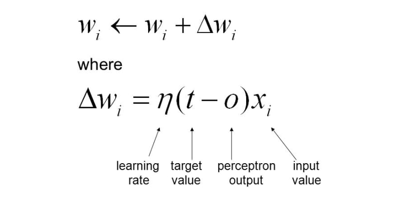
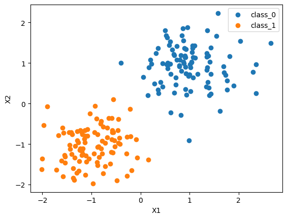
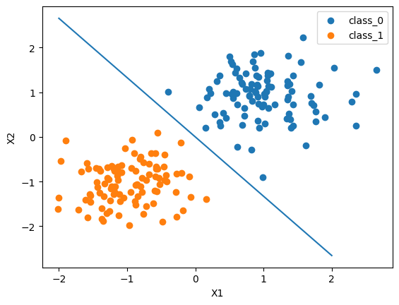

"# NN-LinearPerceptronClassifier" 

# Project Description

In this project, we will implement a linear perceptron classifier from scratch that classifies two random classes. This project aims to become familiar with fundamental neural network learning concepts, so we will keep it easy to understand.

Perceptron classifier can classify two classes that can be divided by a line. in each epoch weights updated by the following equation:

# Example

The input image and the result (the fitted line) are shown as follow:

